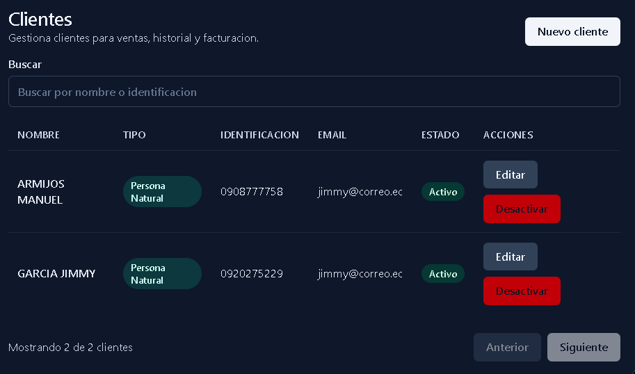
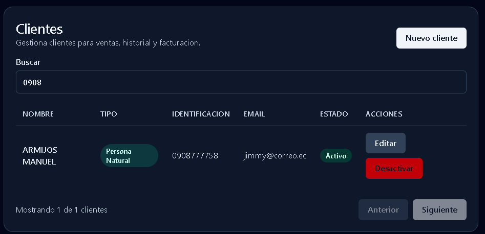
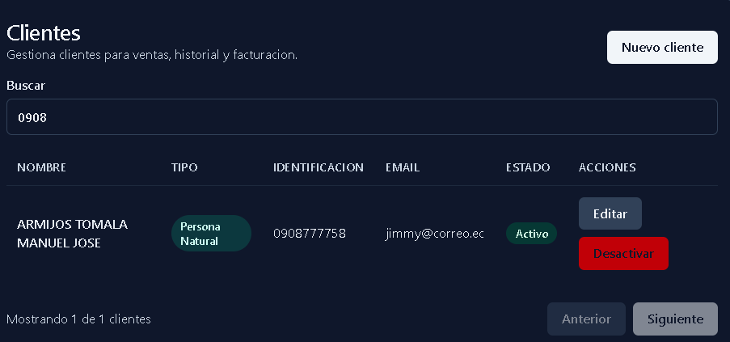
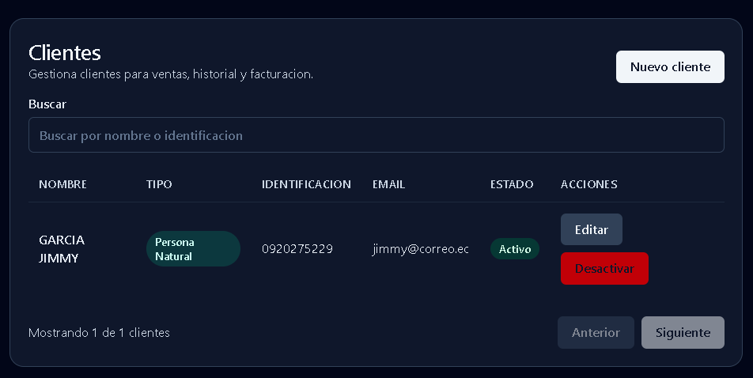
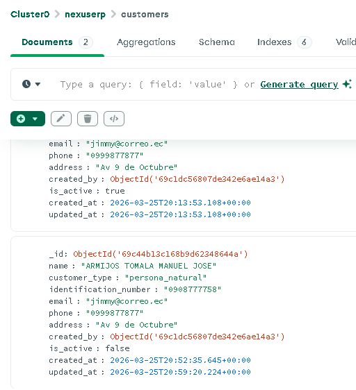

Levanta backend en modo normal y guarda log en archivo.

(.venv) PS C:\Users\jimmy\OneDrive\02 Inteligencia Artificial\frontend\OpenSpec\NexusERP\apps\backend> uvicorn main:app
INFO:     Started server process [1292]
INFO:     Waiting for application startup.
INFO:     Application startup complete.
INFO:     Uvicorn running on http://127.0.0.1:8000 (Press CTRL+C to quit)

Ejecuta operaciones de customers: crear, buscar, listar, editar, desactivar.

Clientes creados

Logs 

INFO:     127.0.0.1:60842 - "GET /customers?skip=0&limit=20 HTTP/1.1" 200 OK
INFO:     127.0.0.1:57847 - "POST /customers HTTP/1.1" 201 Created    
INFO:     127.0.0.1:57847 - "GET /customers?skip=0&limit=20 HTTP/1.1" 200 OK
INFO:     127.0.0.1:54492 - "GET /customers?skip=0&limit=20 HTTP/1.1" 200 OK
INFO:     127.0.0.1:58359 - "GET /customers?skip=0&limit=20 HTTP/1.1" 200 OK
INFO:     127.0.0.1:64284 - "GET /customers?skip=0&limit=20 HTTP/1.1" 200 OK
INFO:     127.0.0.1:57486 - "GET /customers?skip=0&limit=20 HTTP/1.1" 200 OK
INFO:     127.0.0.1:59306 - "OPTIONS /customers?search=ar&skip=0&limit=20 HTTP/1.1" 200 OK
INFO:     127.0.0.1:59306 - "OPTIONS /customers?search=arm&skip=0&limit=20 HTTP/1.1" 200 OK
INFO:     127.0.0.1:57486 - "GET /customers?search=ar&skip=0&limit=20 HTTP/1.1" 200 OK
INFO:     127.0.0.1:64886 - "GET /customers?search=arm&skip=0&limit=20 HTTP/1.1" 200 OK
INFO:     127.0.0.1:64886 - "GET /customers?search=ar&skip=0&limit=20 HTTP/1.1" 200 OK
INFO:     127.0.0.1:64886 - "GET /customers?skip=0&limit=20 HTTP/1.1" 200 OK
INFO:     127.0.0.1:64836 - "OPTIONS /customers?search=A&skip=0&limit=20 HTTP/1.1" 200 OK
INFO:     127.0.0.1:64836 - "OPTIONS /customers?search=AR&skip=0&limit=20 HTTP/1.1" 200 OK
INFO:     127.0.0.1:64886 - "GET /customers?search=A&skip=0&limit=20 HTTP/1.1" 200 OK
INFO:     127.0.0.1:55854 - "GET /customers?search=AR&skip=0&limit=20 HTTP/1.1" 200 OK
INFO:     127.0.0.1:50608 - "PATCH /customers/69c44b13c168b9d62348644a HTTP/1.1" 200 OK
INFO:     127.0.0.1:50608 - "GET /customers?search=0908&skip=0&limit=20 HTTP/1.1" 200 OK
INFO:     127.0.0.1:57711 - "GET /customers?search=0908&skip=0&limit=20 HTTP/1.1" 200 OK
INFO:     127.0.0.1:57711 - "GET /customers?skip=0&limit=20 HTTP/1.1" 200 OK
INFO:     127.0.0.1:57711 - "PATCH /customers/69c44b13c168b9d62348644a HTTP/1.1" 200 OK
INFO:     127.0.0.1:57711 - "GET /customers?skip=0&limit=20 HTTP/1.1" 200 OK
INFO:     127.0.0.1:51039 - "GET /customers?skip=0&limit=20 HTTP/1.1" 200 OK
